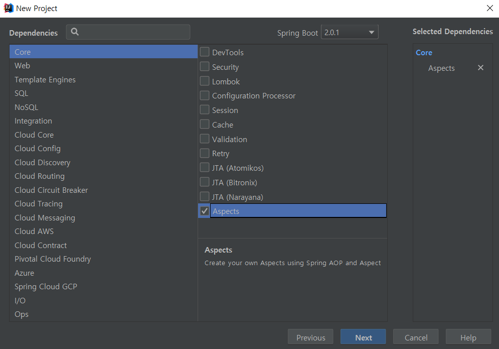
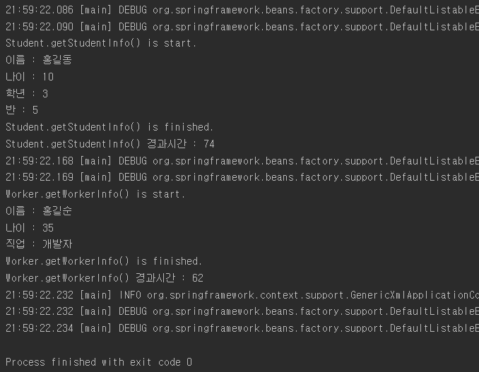
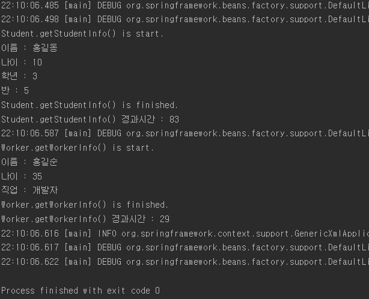

AOP(Aspect Oriented Programming)
===========

## 1. AOP란
AOP는 관점 지향 프로그래밍이라는 뜻인데, 기존의 OOP와 다른 방식으로 프로그램을 설계하는 방법이다. 위키백과를 참고하면 횡단 관심사의 분리를 허용함으로써 모듈성을 증가시키는 것이 목적인 프로그래밍 패러다임이라고 설명하고 있는데, 횡단 관심사란 특정 모듈에서만 필요한 기능이 아니라, 로그, 모니터링, 오류 검출과 같은 프로그램 전반에 필요한 기능들을 뜻한다. Java에서는 C++과 달리 다중상속을 허용하고 있지 않기 때문에 이러한 기능을 구현하기가 까다로운데, Spring에서 AOP를 활용하여 이러한 기능들을 공통기능과 핵심기능으로 구별하여 쉽게 구현할 수 있다. 앞서 말한 프로그램에 전반적으로 필요한 공통적인 기능을 공통기능이라고 하고,  그래서 이러한 기능들의 관점에서 프로그래밍을 하기에 AOP라고 부르는 것이다.

Spring에서는 Proxy를 이용하여 AOP가 구현되어 있는데, 공통기능들을 핵심기능이 있는 클래스에 주입해주고나서 외부에서 호출을 해주면, 실제 객체가 아닌 Proxy가 이 요청을 받아서 처리해주는 대리자 역할을 해준다.
외부 호출 ------> Proxy -----> Target(핵심기능)

그리고 AOP에서는 다양한 용어가 쓰인다.
|용어|뜻|
----|----
Aspect | 공통기능
Advice | 특정 Join point에서 취하는 행동. 여러가지 타입의 Advice가 있다.
Join point | 횡단 관심사를 적용할 수 있는 대상, Advice를 적용해야 하는 부분
Pointcut | 실제로 Advice가 적용된 부분
Weaving | Advice를 핵심 기능에 적용하는 것

Advice의 종류는 다음과 같다.
|종류|뜻|
----|----
Before | Join Point 이전에 Advice 실행
After-returning | Join point가 정상적으로 완료된 후에 Advice 실행
After-throwing | Exception을 던진 method가 있을 시 Advice 실행
After | try-catch-finally 구문에서 finally와 비슷한 것으로 어떤 Join point가 존재하는지와 상관없이, 정상적으로 완료되든 Exception을 던지든간에 상관없이 Advice 실행
Around | Join point를 둘러싼(around) Advice로서, method 실행 전/후 및 Exception 발생시 advice 실행

## 2. 어떻게 구현하나요
바로 구현하면서 보자. DI와 마찬가지로 XML 스키마 기반으로 AOP를 구현할 수도 있고, Annotation을 통해 AOP를 구현할 수도 있다.
Spring Boot로 프로젝트를 만들어주는데 이번에는 Dependency를 골라주어야한다. Core에서 Aspect를 선택해주자.


그러면 일단 구현 준비는 끝이다! Spring Boot 짱짱

학생의 정보를 가지는 Student 클래스와 직장인의 정보를 가지고 있는 Worker 클래스를 만들고, 메서드와 작동시간을 찍어주는 로깅 기능을 만들어보자

Student 클래스는 다음과 같다.
```java
//Student
package com.hackday.aopexample;

public class Student {
    private String name;
    private int age;
    private int gradeNum;
    private int classNum;

    public String getName() {
        return name;
    }

    public void setName(String name) {
        this.name = name;
    }

    public int getAge() {
        return age;
    }

    public void setAge(int age) {
        this.age = age;
    }

    public int getGradeNum() {
        return gradeNum;
    }

    public void setGradeNum(int gradeNum) {
        this.gradeNum = gradeNum;
    }

    public int getClassNum() {
        return classNum;
    }

    public void setClassNum(int classNum) {
        this.classNum = classNum;
    }

    public void getStudentInfo() {
        System.out.println("이름 : " + getName());
        System.out.println("나이 : " + getAge());
        System.out.println("학년 : " + getGradeNum());
        System.out.println("반 : " + getClassNum());
    }
}
```
Worker 클래스는 다음과 같다.
```java
package com.hackday.aopexample;

public class Worker {
    private String name;
    private int age;
    private String job;

    public String getName() {
        return name;
    }

    public void setName(String name) {
        this.name = name;
    }

    public int getAge() {
        return age;
    }

    public void setAge(int age) {
        this.age = age;
    }

    public String getJob() {
        return job;
    }

    public void setJob(String job) {
        this.job = job;
    }

    public void getWorkerInfo() {
        System.out.println("이름 : " + getName());
        System.out.println("나이 : " + getAge());
        System.out.println("직업 : " + getJob());
    }
}
```

그리고 공통기능을 수행할 LogAOP 클래스를 작성해보자.
```java

import org.aspectj.lang.ProceedingJoinPoint;

public class LogAOP {

    public Object loggerAop(ProceedingJoinPoint joinPoint) throws Throwable {
        String signatureStr = joinPoint.getSignature().toShortString(); //method 이름을 가져옴
        System.out.println(signatureStr + " is start."); // method 이름 출력
        long st = System.currentTimeMillis(); // 시작시간 기록

        try {
            Object obj = joinPoint.proceed(); // 핵심기능 진행
            return obj;
        } finally {
            long et = System.currentTimeMillis(); // 끝난시간 기록
            System.out.println(signatureStr + " is finished."); // method 끝났다고 출력
            System.out.println(signatureStr + " 경과시간 : " + (et - st)); // 경과시간 출력
        }
    }
}
```

여기서는 around를 이용하여 AOP를 구현해볼 것이다.

### XML을 이용한 AOP 구현
resources 폴더에 applicationCTX.xml을 만들어주자. Student와 Worker, LogAOP의 bean을 하나씩 만들어주었다.
```xml
    <bean id="logAOP" class="com.hackday.aopexample.LogAOP">

    <bean id="student" class="com.hackday.aopexample.Student">
        <property name="name" value="홍길동"/>
        <property name="age" value="10"/>
        <property name="gradeNum" value="3"/>
        <property name="classNum" value="5"/>
    </bean>

    <bean id="worker" class="com.hackday.aopexample.Worker">
        <property name="name" value="홍길순"/>
        <property name="age" value="35"/>
        <property name="job" value="개발자"/>
    </bean>
```

그리고 AOP를 설정해주자. beans 태그에 
```
xmlns:aop="http://www.springframework.org/schema/aop"
```
을 추가시켜줘야 하는데, 하지않고 바로 설정을 하면 IntelliJ가 경고창 띄우면서 넣어준다.

그리고 다음과 같이 beans 태그 사이에 추가해준다.
```xml
    <aop:config> <!-- AOP 설정을 시작하겠다! -->
        <aop:aspect id="logger" ref="logAop"> <!-- logAOP를 참조하는 aspect 생성 -->
            <aop:pointcut id="publicM" expression="within(com.hackday.aopexample.*)"/> <!-- com.hackday.aopexample에 존재하는 모든 method에 advice 적용 -->
            <aop:around pointcut-ref="publicM" method="loggerAop"/> <!-- method 호출 이전과 이후 모두 적용 -->
        </aop:aspect>
    </aop:config>
```

그러면 설정 끝이다. Main 클래스를 작성해보자
```java
package com.hackday.aopexample;

import org.springframework.context.support.AbstractApplicationContext;
import org.springframework.context.support.GenericXmlApplicationContext;

public class MainClass {

    public static void main(String[] args) {
        AbstractApplicationContext ctx = new GenericXmlApplicationContext("classpath:applicationCTX.xml");

        Student student = ctx.getBean("student", Student.class);
        student.getStudentInfo();

        Worker worker = ctx.getBean("worker", Worker.class);
        worker.getWorkerInfo();

        ctx.close();
    }
}
```
Main 클래스는 뭐 별 다른점이 없다. Around 속성이 적용되었으니 student.getSudentInfo()와 worker.getWorkerInfo()의 시작과 끝에서 advice가 실행될 것이다.
실행해보자!


### Annotation을 이용한 AOP 구현
xml을 구현했던거랑 크게 다른 점은 없다. \<aop:config\>를 이용했던 부분을 지워주고, 클래스에서 proxy를 잡을 수 있도록 auto-proxy를 설정해준다.
```xml
 <aop:aspectj-autoproxy/>
 ```

 그리고 원래있던 LogAOP 클래스에 annotation 몇개만 붙여주면 끝이다.
 ```java
 package com.hackday.aopexample;

import org.aspectj.lang.ProceedingJoinPoint;
import org.aspectj.lang.annotation.Around;
import org.aspectj.lang.annotation.Aspect;
import org.aspectj.lang.annotation.Pointcut;

@Aspect // 이 Class를 AOP 설정용 클래스로 쓰겠다!
public class LogAOP {

    @Pointcut("within(com.hackday.aopexample.*)") // <aop:pointcut id="publicM" expression="within(com.hackday.aopexample.*)"/> 과 동일한 부분
    private void pointcutMethod() {
    }

    @Around("pointcutMethod()") //<aop:around pointcut-ref="publicM" method="loggerAop"/> 과 동일한 부분
    public Object loggerAop(ProceedingJoinPoint joinPoint) throws Throwable {
        String signatureStr = joinPoint.getSignature().toShortString();
        System.out.println(signatureStr + " is start.");
        long st = System.currentTimeMillis();

        try {
            Object obj = joinPoint.proceed(); // 핵심기능 진행
            return obj;
        } finally {
            long et = System.currentTimeMillis();
            System.out.println(signatureStr + " is finished.");
            System.out.println(signatureStr + " 경과시간 : " + (et - st));
        }
    }
}
```
그리고 실행해보자.


당연하게도 결과는 동일하다.

Annotation을 이용하여 설정하는게 쪼끔 더 편리해보이기도 하고 최근 기법이라고 한다.