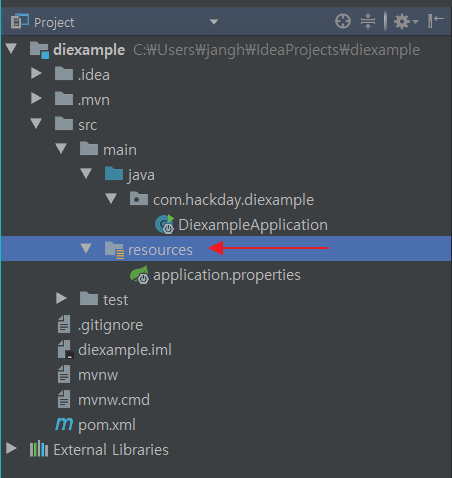
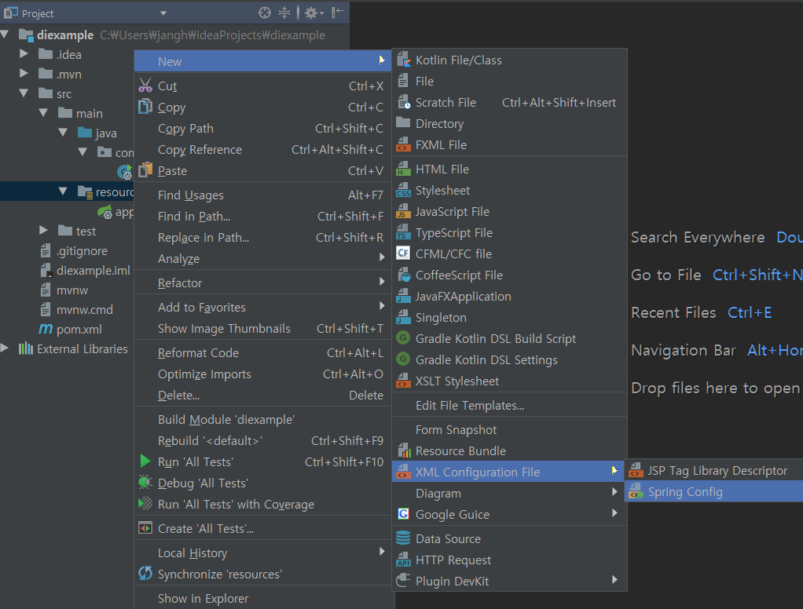
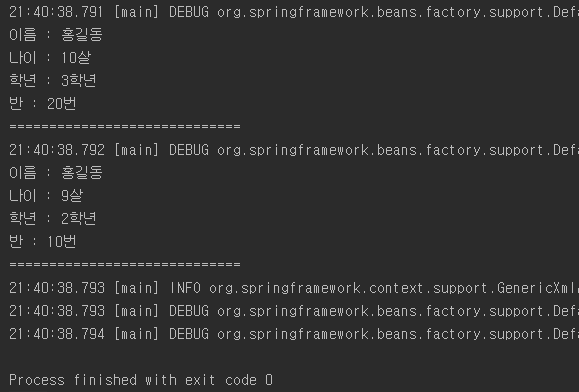
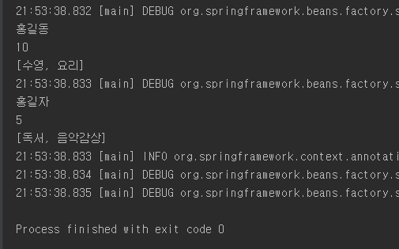

DI(Dependency Injection)
==============

## 1. DI란?
먼저 Dependency란 한 객체가 다른 객체에 의존한다는 뜻이다. 쉽게 말해 A 객체에서 B 객체를 사용하는데, B 객체가 제대로 작동하지 않는다면 A도 제대로 작동하지 않을 것이다. 이러한 관계를 가지는 것을 Dependency라고 하는데, 이러한 Dependency는 일반적으로 프로그램 소스에 의해 생성되는데 프레임워크를 쓰면 이러한 프로그램의 흐름을 프레임워크가 제어하여, 필요할 때 마다 프로그램의 코드를 호출한다. 그래서 소스에서 new를 통해 객체를 생성하는 것이 아니라 프레임워크의 제어권을 가지고 있는 컨테이너가 객체를 생성하고 생명주기까지 관리할 수 있는데, 원래의 프로그램 제어권이 바뀌었다하여 이 컨테이너를 IoC(Inversion of Control) 컨테이너라고 부른다. 이렇게 되면 소스코드들 사이에 Coupling level이 감소하여 유지보수가 용이한 이점이 있다.

## 2. 뭔말인지 모르겠어요. 소스를 보여주세요.
DI가 적용되지 않은 경우와 적용된 경우를 살펴보자.
### DI가 적용되지 않은 경우
```java
public class Foo{
    private Bar bar;

    public Foo() {
        bar = new Bar();
    }
}
```
일반적으로 우리가 읽는 코드이다. Foo 객체에서 Bar 객체를 인스턴스화를 하게 되어 Dependency가 생기게 된다. 이러한 소스에서는 bar 객체에 다른 객체를 인스턴스화 해줄려면 아예 소스코드를 바꾸어야한다.

### DI가 적용된 경우
DI가 적용된 경우를 보자. 이제 IoC 컨테이너가 따로 필요하다.
```xml
// IoC 컨테이너
<beans>
    <bean id="bar" class="Bar"/>
    <bean id="foo" class="Foo">
        <property name="bar" ref="bar"/>
    </bean>
</beans>
```
```java
//프로그램 코드
public class Foo{
    private Bar bar;

    public void setBar(Bar bar) {
        this.bar = bar;
    }
}
```
IoC 컨테이너에 사용할 객체들을 등록하였다. 그리고 프로그램 코드에서 setBar를 통해 Dependency를 만들어주었다. 이렇게 되면 bar에 다른 객체를 인스턴스화 하고 싶다면 컨테이너의 내용만 바꾸면 손쉽게 소스코드 수정 없이 프로그램의 유지보수가 가능해진다.

## 3. 그래서 Spring에서 어떻게 쓰는데요?
XML 파일을 이용한 방법과 Java 클래스 파일을 이용하여 DI를 설정하는 방법이 있다. 
### XML을 이용한 방법
Spring Boot를 이용하여 Spring 프로젝트를 만들어준다. 그리고 학생의 정보를 가지는 Student 클래스와 학생의 정보를 출력해주는 기능을 가지는 StudentInfo 클래스를 만들어보자.

```java
//Student
package com.hackday.diexample;

public class Student {

    private String name;
    private String age;
    private String gradeNum;
    private String classNum;

    public Student(String name, String age, String gradeNum, String classNum) {
        this.name = name;
        this.age = age;
        this.gradeNum = gradeNum;
        this.classNum = classNum;
    }

    public String getName() {
        return name;
    }

    public void setName(String name) {
        this.name = name;
    }

    public String getAge() {
        return age;
    }

    public void setAge(String age) {
        this.age = age;
    }

    public String getGradeNum() {
        return gradeNum;
    }

    public void setGradeNum(String gradeNum) {
        this.gradeNum = gradeNum;
    }

    public String getClassNum() {
        return classNum;
    }

    public void setClassNum(String classNum) {
        this.classNum = classNum;
    }
}
```

```java
//StudentInfo
package com.hackday.diexample;

public class StudentInfo {

    private Student student;

    public StudentInfo(Student student) {
        this.student = student;
    }

    public void getStudentInfo(){
        if(student != null){
            System.out.println("Name : " + student.getName());
            System.out.println("Age : " + student.getAge());
            System.out.println("GradeNum : " + student.getGradeNum());
            System.out.println("ClassNum : " + student.getClassNum());
            System.out.println("=============================");
        }
    }

    public void setStudent(Student student) {
        this.student = student;
    }
}
```

그 다음 src.main.resources에 컨테이너로 쓰일 xml 파일을 만들어준다. applicationCTX.xml이라고 명명하겠다.  



applicatinCTX.xml의 <beans> 태그 사이에 bean들을 만들어준다. studend1처럼 작성해도 되고, student2처럼 작성해도 모두 똑같이 작동한다. 그리고 studentInfo bean에 student1을 참조하도록 하였다.
```xml
    <bean id="student1" class="com.javalec.ex.Student">
        <constructor-arg>
            <value>홍길동</value>
        </constructor-arg>
        <constructor-arg>
            <value>10살</value>
        </constructor-arg>
        <constructor-arg>
            <value>3학년</value>
        </constructor-arg>
        <constructor-arg>
            <value>20번</value>
        </constructor-arg>
    </bean>

    <bean id="student2" class="com.javalec.ex.Student">
        <constructor-arg value="홍길동"/>
        <constructor-arg value="9살"/>
        <constructor-arg value="2학년"/>
        <constructor-arg value="10번"/>
    </bean>

    <bean id="studentInfo" class="com.javalec.ex.StudentInfo">
        <constructor-arg>
            <ref bean="student1"/>
        </constructor-arg>
    </bean>
```

그리고 Main 클래스를 작성한다.
```java
//Main Class
package com.hackday.diexample;

import org.springframework.context.support.AbstractApplicationContext;
import org.springframework.context.support.GenericXmlApplicationContext;

public class MainClass {

    public static void main(String[] args) {
        String configLocation = "classpath:applicationCTX.xml";
        AbstractApplicationContext ctx = new GenericXmlApplicationContext(configLocation);
        StudentInfo studentInfo = ctx.getBean("studentInfo", StudentInfo.class); //컨테이너로부터 studentInfo bean을 StudentInfo 클래스로 캐스팅되어 가져옴
        studentInfo.getStudentInfo(); //홍길동, 10살, 3학년, 20번 출력

        Student student2 = ctx.getBean("student2", Student.class); //컨테이너로부터 student2 bean을 가져옴
        studentInfo.setStudent(student2); //studentInfo의 student를 student2로 설정
        studentInfo.getStudentInfo(); //홍길동, 9살, 2학년, 10번 출력

        ctx.close(); //컨테이너 닫음
    }
}
```

실행해보면 Spring 관련 메시지가 잔뜩 뜨고 다음과 같이 출력되는 걸 볼 수 있다.  


### Java 클래스 파일을 이용한 방법
다시 Spring Boot를 이용하여 프로젝트를 만들어준다. 이번엔 Student 클래스만 활용해볼텐데 이름과 나이, 그리고 ArrayList로 취미 배열을 가지는 Student 클래스를 만들어보자.
```java
//Student
package com.hackday.diexample2;

import java.util.ArrayList;

public class Student {

    private String name;
    private int age;
    private ArrayList<String> hobbys;

    public Student(String name) {
        this.name = name;
    }

    public String getName() {
        return name;
    }

    public void setName(String name) {
        this.name = name;
    }

    public int getAge() {
        return age;
    }

    public void setAge(int age) {
        this.age = age;
    }

    public ArrayList<String> getHobbys() {
        return hobbys;
    }

    public void setHobbys(ArrayList<String> hobbys) {
        this.hobbys = hobbys;
    }
}
```

그리고 같은 패키지에 DI를 위한 Java 클래스를 만들어준다. ApplicaionConfig라고 하겠다.
```java
//ApplicationConfig
package com.hackday.diexample2;

import org.springframework.context.annotation.Bean;
import org.springframework.context.annotation.Configuration;

import java.util.ArrayList;

@Configuration //스프링 설정에 사용되는 클래스라는 annotation
public class ApplicationConfig {

    @Bean // 객체생성 annotation
    public Student student1() {
        ArrayList<String> hobbys = new ArrayList<String>();
        hobbys.add("수영");
        hobbys.add("요리");

        Student student = new Student("홍길동");
        student.setAge(10);
        student.setHobbys(hobbys);

        return student;
    }

    @Bean
    public Student student2() {
        ArrayList<String> hobbys = new ArrayList<String>();
        hobbys.add("독서");
        hobbys.add("음악감상");

        Student student = new Student("홍길자");
        student.setAge(5);
        student.setHobbys(hobbys);

        return student;
    }
}
```
전체적인 구조는 xml과 크게 다르지 않다. 표현이 Java 언어로 된 것 뿐이다.특이한 점이라곤 annotation이 좀 추가 되었다는 것이다.

이제 MainClass 작성해보자
```java
//Main Class
package com.hackday.diexample2;

import org.springframework.context.annotation.AnnotationConfigApplicationContext;

public class MainClass {
    public static void main(String[] args) {
        AnnotationConfigApplicationContext ctx = new AnnotationConfigApplicationContext(ApplicationConfig.class);

        Student student1 = ctx.getBean("student1", Student.class);
        System.out.println(student1.getName());
        System.out.println(student1.getAge());
        System.out.println(student1.getHobbys());


        Student student2 = ctx.getBean("student2", Student.class);
        System.out.println(student2.getName());
        System.out.println(student2.getAge());
        System.out.println(student2.getHobbys());

         ctx.close();
    }
}
```

컨텍스트를 가져오는 방법이 조금 바뀌었지만, 사용하는 방법은 달라진 점이 없다.

실행해보면 다음과 같이 출력된다.  
