MVC(Model-View-Controller) Pattern
========================

## 1. MVC란
이제 Spring에 대해 대강 알게된 것 같으니 웹개발을 할 수도 있을 것 같다. 웹 개발을 할려면 MVC 패턴에 대해 알아야 하는데 MVC란 Model-View-Controller의 줄임말이다. 데이터를 담당하는 Model, 화면을 담당하는 View, 데이터 처리를 담당하는 Controller로 나누어 각 모듈들을 재사용하기 쉽도록 해주는 디자인 패턴이다.

Spring에서의 MVC 패턴 처리 과정은 다음과 같다.
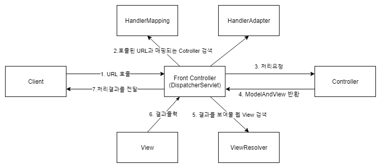

|구성요소|설명|
|-------|----|
DispatcherServlet | Client의 요청을 전달받는다. HandlerMapping을 통해 요청에 적절한 Controller를 호출하고, Controller가 리턴한 결과값을 ViewResolver를 통해, 적절한 View를 전달받아 Client에게 응답을 생성한다.
HandlerMapping | Client의 요청에 적절한 Controller를 결정한다.
HandlerAdapter | HTTP request를 용이하게 처리하기 위한 Interface이다.
Controller | Client의 요청을 처리하여, 그 결과를 DispatcherServlet에게 전달한다.
ViewResolver | 결과에 적절한 View를 검색한다.
View | 처리결과를 DispatcherServlet에게 전달한다.

## 2. 됐고, 직접해봅시다.
Spring Boot로 새로 프로젝트를 만들자. 근데 이번엔 Gradle로 만들어보자.
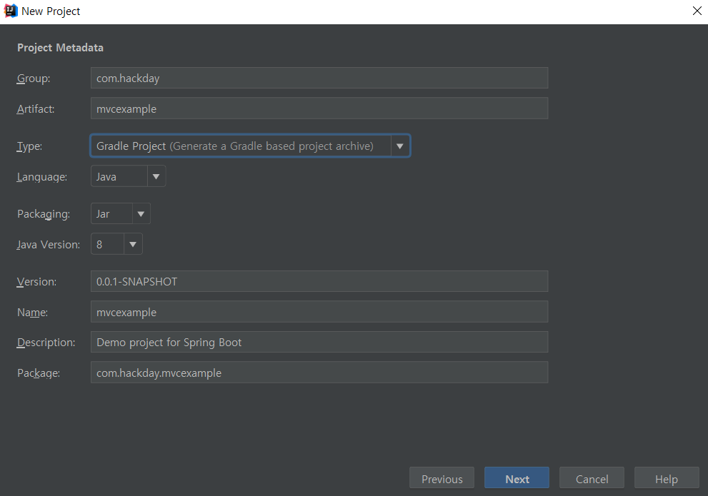

그리고 이제 웹 서비스를 본격적으로 만들어볼테니 Dependency에서 Web을 선택해준다.
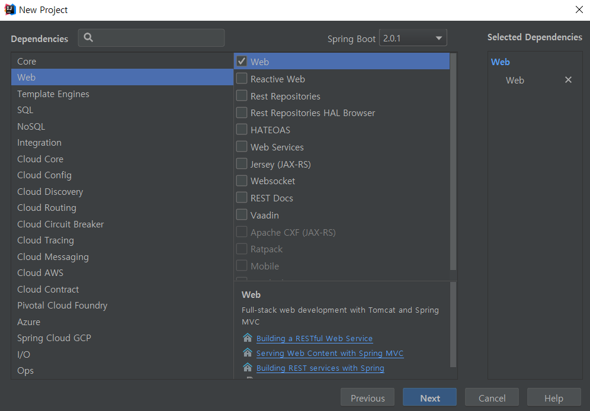

템플릿 엔진은 아직 몰라서 그냥 jsp를 사용해줄 것이라 아무것도 선택하지 않았다.

그리고 프로젝트를 만들어주면 설정할 게 또 뜨는데 그냥 기본으로 되어 있는대로 했다.
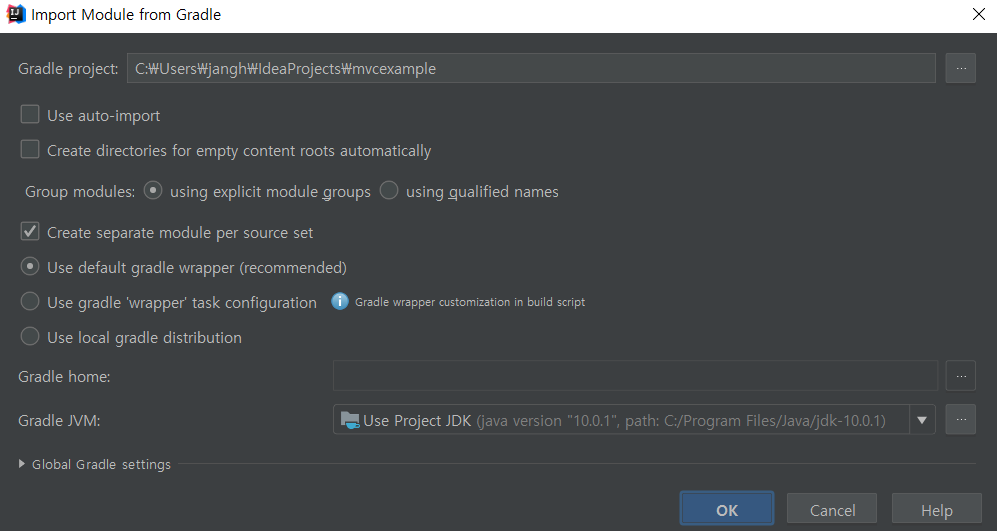

그러고나면 Gradle이 이것저것 받아와서 알아서 Build를 해준다.
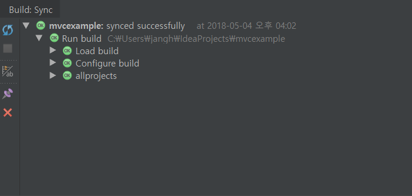

그리고 지금 이 설정으로는 jsp 뷰를 사용할 수 없어서 Dependency를 추가해줘야 한다. build.gradle을 열어보자.
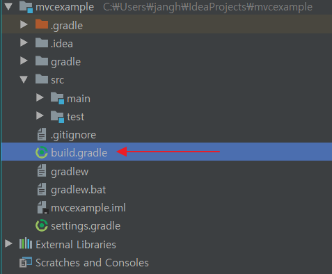

그리고 제일 아래를 보면 dependencies라는 것이 보인다. Maven을 사용할때 pom.xml에 있던 내용들과 비슷해 보인다. 여기에 내부 톰캣 서버를 사용하는 dependency와 jsp뷰를 쓰기위한 dependency를 다음과 같이 추가해준다.
```
    compile('org.apache.tomcat.embed:tomcat-embed-jasper')
    compile('javax.servlet:jstl')
```
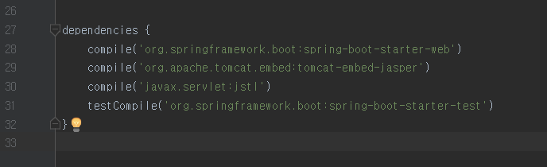

그리고 나서 import changes를 해주면 gradle이 추가된 dependency들을 가져와서 build해준다.

그리고 jsp를 출력하기 위한 설정값을 resources 폴더에 있는 application.properties에 입력해준다.
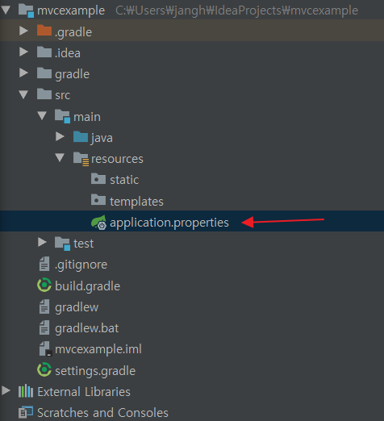

prefix와 suffix를 설정해주었다.
```
spring.mvc.view.prefix=/WEB-INF/
spring.mvc.view.suffix=.jsp
```

그러면 설정은 끝이다! 간단한 웹페이지를 띄워보자.

먼저 jsp를 만들어보자.
src/main 폴더에 webapp/WEB-INF 폴더를 만들고 index.jsp를 생성해주었다. 
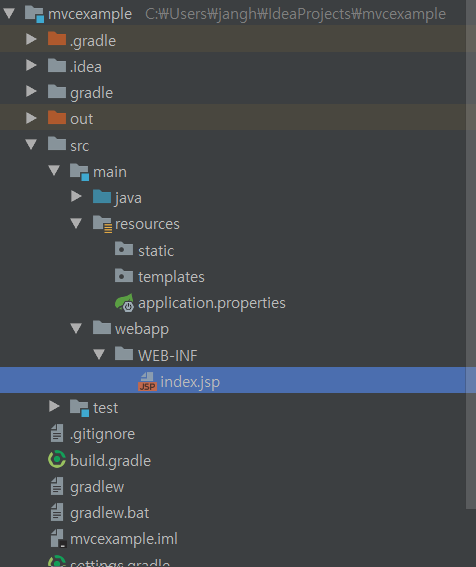

그리고 내용은 다음과 같이 적었다.
```jsp
<%@ page language="java" contentType="text/html; charset=UTF-8"
    pageEncoding="UTF-8"%>
<!DOCTYPE html>
<html>
<head>
    <meta http-equiv="Content-Type" content="text/html; charset=UTF-8">
    <title>Hello, Spring!</title>
</head>
<body>
안녕, 스프링!
</body>
</html>
```

한글이 잘 출력되는지 볼려고 한글도 넣어보았다.

그리고 이 jsp를 출력해주기 위한 controller를 작성해야한다. HomeController.java 파일을 패키지 밑에 생성해주었다.
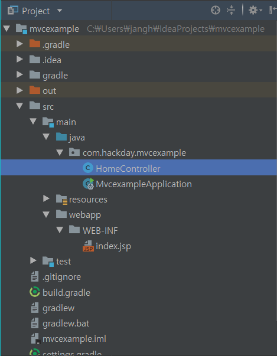

그리고 다음과 같이 작성하였다.
```java
package com.hackday.mvcexample;

import org.springframework.stereotype.Controller;
import org.springframework.web.bind.annotation.RequestMapping;

@Controller //이 클래스를 Controller로 쓰겠다!
public class HomeController {

    @RequestMapping("/index") //index라고 들어오는 Request에 대해 이렇게 처리하겠다!
    public String index() {
        return "index"; //설정해준 prefix와 suffix에 의해 /WEB-INF/index.jsp가 브라우저에 나타날 것이다.
    }
}
```

그리고 이제 서버를 가동하고, 인터넷 브라우저에 localhost:8080/index 라고 입력하면,
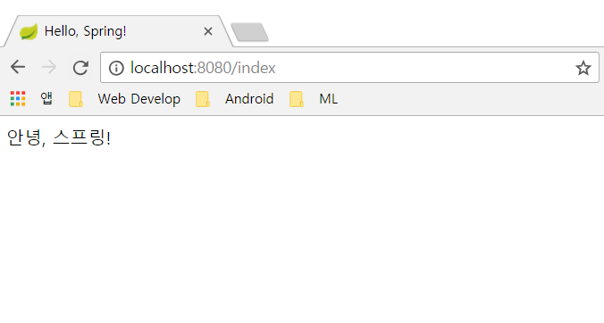

한글도 제대로 뜬다!
