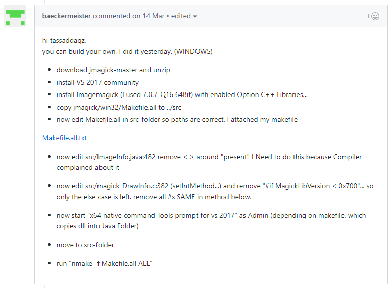
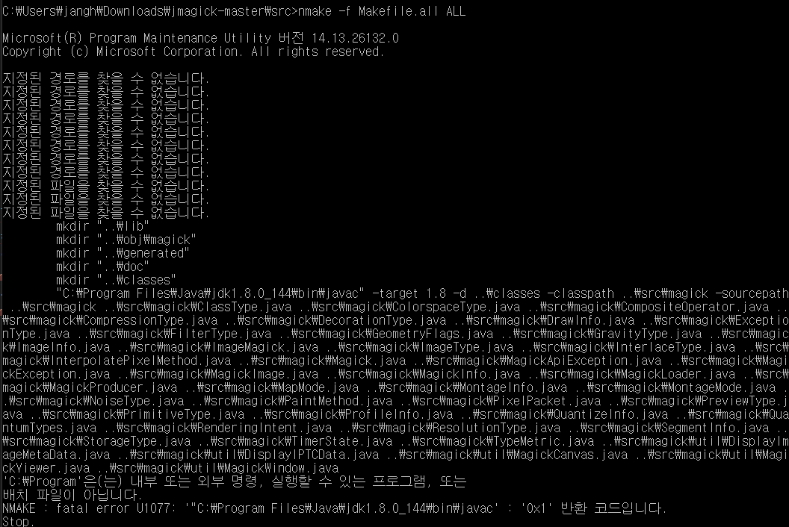
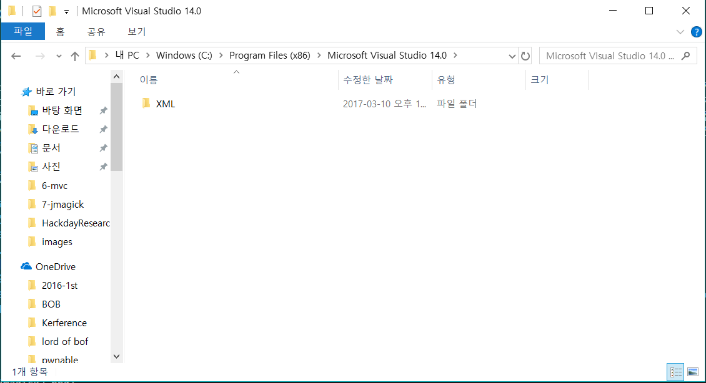
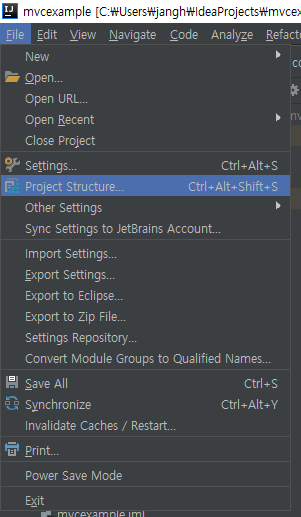
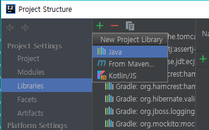
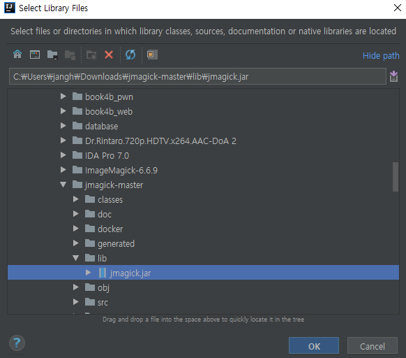
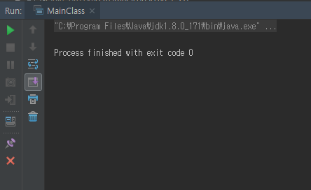

JMagick
========

## 1. JMagick이란
JMagick은 ImageMagick을 Java에서 사용하게 해주는 인터페이스이다. ImageMagick은 그래픽 이미지를 새로 만들거나, 수정하는데 사용되는 오픈소스 소프트웨어인데, 이번에 진행할 주제와 관련하여 annimated gif를 만들어내거나, 수정할 수 있다. 또한 Quantization과 관련한 기능도 있어서 이번 해커톤에서 사용하기에 적절해보인다.

## 2. 설치는 어떻게 하지
gradle로 간단히 가져올 수 있겠지하여서 gradle에서 compile('jmagick:jmagick:6.6.9')을 추가해주었다. 그리고 다음과 같이 코드를 작성해보았는데 import도 잘해온다. test.jpg라는 이미지 파일을 열어서 왼쪽상단으로부터 50, 50이 되는 자리에 불투명도 100%로 글자크기 36으로 Arial 폰트로 노란색으로 된 JMagick Tutorial을 적어주어 text.jpg라는 파일로 저장해주는 코드이다. 
```java
package com.hackday.jmagick;

import magick.*;

public class MainClass {
    public static void main(String a[]) throws MagickException
    {
        ImageInfo info=new ImageInfo("test.jpg");
        MagickImage image=new MagickImage(info);
        DrawInfo aInfo = new DrawInfo(info);
        aInfo.setFill(PixelPacket.queryColorDatabase("yellow")); // 이 색으로 그릴거다

        aInfo.setOpacity(100); // 불투명도는 100이다
        aInfo.setPointsize(36); // 사이즈는 36이다.
        aInfo.setFont("Arial"); // 폰트는 Arial이다.

        aInfo.setGeometry("+50+50"); // 왼쪽 상단으로부터 +50+50되는 위치에서 시작할거다.
        aInfo.setText("JMagick Tutorial"); // 이렇게 적을거다.

        image.annotateImage(aInfo); // 실제로 이미지에 위에 있는 세팅대로 한다.
        image.setFileName("text.jpg"); // 저장할 이미지 이름은 이렇게 할거다.
        image.writeImage(info); // 저장!
    }
}
```

돌려보니 안된다. 찾아보니 JMagick 버전과 동일한 ImageMagick dll 파일이 필요하다고 해서 간단히 받으면 되겠지 했는데, 현재 호환되는 버전의 dll이 배포되고 있지가 않다. 현재 배포되고 있는 ImageMagick은 7.0.7이고, JMagick은 6.6.9이다. 그래서 옛날 버전을 모아놓은 repo가 있겠지해서 찾아봤는데 없다... 당시 소스코드를 받았는데 dll은 다운로드가 안된다... 2011년도에 배포했던 버전 같다. 그래서 JMagick이 최신버전에 호환되는 인터페이스를 내놓았겠지 했는데 JMagick 홈페이지에 들어가니 오히려 gradle에서 가져온 버전보다 더 구버전에서 업데이트가 멈춰있다. 잠시 패닉에 빠졌다. JMagick의 repo가 있어서 찾아보니 6.7.7까지의 브랜치가 있다. 이 버전도 dll을 구할 수가 없었다. 제작자도 빌드 안한지 오래됐다고 인정했다.
 

그래서 어떡하지 하다가 이슈에서 답을 찾았다. 직접 빌드를 하라는 것이다. 



1. 일단 이 repo를 다운로드하고
2. VS 2017 Community를 인스톨
3. ImageMagick을 C++ 라이브러리 옵션을 체크하고 인스톨
4. jmagick/win32/Makefile.all 을 ../src로 복사
5. Makefile.all을 좀 고쳐야한다는데 자기가 고쳐놨단다.
6. src/ImageInfo.java:482의 present를 감싸고 있는 <>를 삭제
7. src/magick_DrawInfo.c:382의 "#if MagickLibVersion \< 0x700"를 비롯한 매크로 행들을 삭제하고 else 부분 이였던 내용만 남겨둔다. 바로 밑에 있는 method도 똑같이 삭제
8. x64 native command Tools prompt for vs 2017를 관리자권한으로 실행
9. src 폴더로 이동
10. nmake -f Makefile.all ALL

했는데 안된다.

경로와 파일문제가 발생하니 Makefile의 몇몇 경로가 나의 시스템과 맞지 않나보다. Makefile을 뜯어보니 VS의 경로가 맞지 않은 것 같은 직감이 들었다. 전에 커맨드라인에서 컴파일 해볼거라고 VS Path 환경변수 설정을 한다고 삽질을 했던 적이 있어서 때문이다. Makefile에 적혀있는 경로에 가보니 아무것도 없다. 
```
# The C compiler
CPPINC=C:\Program Files (x86)\Microsoft Visual Studio 14.0\VC\include
CPPLIB=C:\Program Files (x86)\Microsoft Visual Studio 14.0\VC\Lib\amd64
```


적혀있는 곳과 동일하게 작동하는 폴더를 찾아야한다. 그리 어렵지 않게 찾을 수 있었다. 먼저 나온 줄은 헤더들이 있는 include 폴더를 찾으면 됐었고, amd64는 64비트를 의미하기에 라이브러리 폴더를 찾아보니 x64로 폴더명이 바뀌어 있었다. 그래서 다음과 같이 고쳐주었다.
```
# The C compiler
CPPINC=C:\Program Files (x86)\Microsoft Visual Studio\2017\Community\VC\Tools\MSVC\14.13.26128\include
CPPLIB=C:\Program Files (x86)\Microsoft Visual Studio\2017\Community\VC\Tools\MSVC\14.13.26128\lib\x64
```

그리고 jdk 부분도 수정해주어야 했다.
```
# File places for Java:
JDKDIR=C:\Program Files\Java\jdk1.8.0_144
JNIINC=$(JDKDIR)\include
JDKBIN=$(JDKDIR)\bin
```

jdk 1.8.0_144로 되어 있는데 원래 파일에는, 하지만 나의 컴퓨터에 깔려있는 jdk는 jdk 1.8.0_171이다.
```
# File places for Java:
JDKDIR=C:\Program Files\Java\jdk1.8.0_171
JNIINC=$(JDKDIR)\include
JDKBIN=$(JDKDIR)\bin
```

그리고 빌드하니 드디어 빌드가 된다. 빌드 이슈 해결한다고 한 5시간 걸렸다... ㅠㅠ

이제 IntelliJ에서 외부 라이브러리로 가져와주면 된다.  






## 3. 돌려보자 이제 쫌
그래서 다시 원래 코드로 돌아왔다. 돌려보자. 프로젝트 폴더에 test.jpg라는 이미지 파일이 있어야한다. 구글에서 test jpg를 아무거나 골라서 왔다.


돌려보자.



우아하게 에러없이 종료된다 ^_^

그리고 다음과 같은 이미지를 얻었다.


JMagick Tutorial이라고 잘 적혀있는 걸 확인할 수 있다.